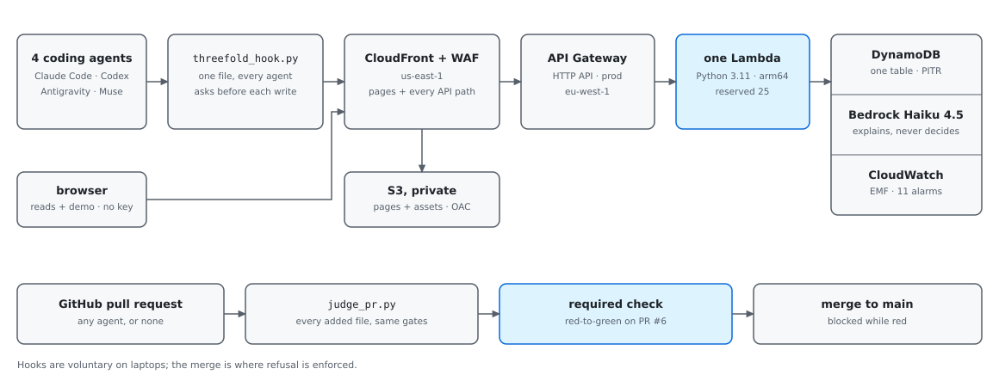

# Threefold

**Threefold refuses a coding agent's edit the moment it is made, not after the commit, so your architecture does not rot while you sleep.**

Built for the AWS Zero to Shipped hackathon. **Category:** `#workplace-efficiency` · **Lane:** `#community`

[Live demo](https://d1og72wpk4aqig.cloudfront.net/) ·
[Dashboard](https://d1og72wpk4aqig.cloudfront.net/dashboard.html#/overview) ·
[API](https://raa131f9dj.execute-api.eu-west-1.amazonaws.com/prod/) ·
[CI](https://github.com/upgradedev/aws-threefold/actions/workflows/ci.yml) ·
[Evidence](#evidence) · [Install](#install-it-in-front-of-your-own-agent)

[](https://python.org)
[](LICENSE)
[](https://github.com/upgradedev/aws-threefold/actions/workflows/ci.yml)
[](https://github.com/upgradedev/aws-threefold/actions/workflows/keepalive.yml)

Threefold sits in front of the tool calls a coding agent makes (Claude Code,
Codex, Antigravity and Muse, through one hook file) and answers each write or
command before it runs. Deterministic gates decide: a domain file importing
infrastructure under the architect's layering rules, a credential in the
arguments, a write that switches the hooks off, the same call repeating, a
spend ceiling. A team connects a repository with one command, and by default a
project starts in **Observe**: calls are judged and recorded and no rule refuses
anything. What is still refused there is a credential, by the hook on the
developer's own machine, and a request the service cannot take at all (a body
over 1 MB, a malformed call, a key it rejects), because the hook reads any 4xx
answer other than 429 as a refusal. The operations dashboard shows what
each rule *would* have refused; the operator marks each of those correct or a
false alarm, promotes the project to **Enforce** with the rules that earned it,
and demotes it with one click. Amazon Bedrock never decides; it phrases a
refusal for a person reading a page and drafts rules for an architect, and
every response names which of the two you are reading.

## Contents

[Live](#live) · [Two minutes](#two-minutes-no-account) ·
[Install](#install-it-in-front-of-your-own-agent) · [Rollout](#the-two-stage-rollout) ·
[Sign in](#sign-in-without-pasting-a-key) ·
[Gates](#what-the-gates-watch-and-what-they-are-blind-to) ·
[Architecture](#architecture-in-brief) · [Run it](#run-it-locally) ·
[Evidence](#evidence) · [Clean room](#clean-room) · [Licence](#licence)

## Live

| | URL | What it is |
|---|---|---|
| **Site** | **<https://d1og72wpk4aqig.cloudfront.net/>** | CloudFront in front of everything: the pages from a private S3 bucket, every API path to the function, AWS WAF, security headers |
| Origin | <https://raa131f9dj.execute-api.eu-west-1.amazonaws.com/prod/> | the API Gateway URL the edge forwards to. It serves the same pages from the function and stays public; it has no WAF, its pages carry none of the edge's headers, and its files (`/install.py`, `/hooks/*`, `/assets/*`) carry only `x-content-type-options: nosniff` of them. The trailing slash is part of it: the bare `/prod` is API Gateway's own 404 |

Both answered anonymously, with no key, on 2026-09-22: `GET /` returned 200
`text/html` from each, and the site's response carried HSTS, a content security
policy, `x-frame-options: DENY`, `nosniff` and `referrer-policy: no-referrer`
[PRIMARY, 2026-09-22]. How the two fit together, and why both exist:
[`docs/ARCHITECTURE.md`](docs/ARCHITECTURE.md).

## Two minutes, no account

1. **The two-stage rollout, on a project of your own:**
   <https://d1og72wpk4aqig.cloudfront.net/dashboard.html#/try>. About two
   minutes for a reader, as the walkthrough itself says. Five steps:
   - **Make a sandbox.** A project `Acme-Sandbox-<8 hex>` in Observe, seeded
     with twelve synthetic hook calls from all three agents through the real
     evaluator. The answer to `POST /api/sandbox` also names, in
     `seeded_false_alarm`, the one seeded call a reasonable reviewer would call
     a false alarm: a test module under `tests/domain/`, which
     `python-domain-stays-pure` flags because its path pattern covers any
     folder named `domain`.
   - **See what would be refused.** Every flagged call, grouped by rule; each
     one ran.
   - **Label each call.** The page asks you to spot the false alarm and, once
     every call has a label, says whether you found it and what your labels
     decide.
   - **Promote.** The rules that read Ready are checked for you and nothing
     else is; the rule with the false alarm reads Noisy and keeps observing.
   - **Send it again.** The page shows the call it is about to send, the same
     agent, file and import as a call you marked correct in Observe wherever a
     rule you promoted flagged one, and sends it only when you press Send it.
     It comes back refused, with the fix it suggests.

   That last call is sent in a `try-` session, which the project's stage decides
   like any hook's call: one step earlier the same call was recorded and
   approved, and it is refused only because the project now enforces. (`sim-`
   sessions enforce whatever the stage, which is why the walkthrough does not
   use one.) The two minutes are reading time: a script that pressed each
   button the moment the page enabled it reached the refusal in under two
   seconds, and the page had finished drawing it within three, against a local
   server with no network and no model (measured 2026-09-28). After 24 hours the
   sandbox's stage configuration expires and the project drops out of the
   overview and the project list; its calls and labels stay in the public call
   lists until the ledger's own 30-day expiry, and its daily counters stay in
   the table, no longer shown, for 35 days.
2. **The flagship demo, well under a minute:**
   <https://d1og72wpk4aqig.cloudfront.net/>. Scenario 1 is one click and one
   `POST /simulate-loop`; the function evaluates the same call three times and
   the third is refused with `BLOCKED_LOOP_DETECTED`, halting that demo
   session. Scenario 4 evaluates four ordinary calls and issues a governance
   certificate. Every click gets a fresh session.
3. **The dashboard itself:**
   <https://d1og72wpk4aqig.cloudfront.net/dashboard.html#/overview>. Every tile
   and bar opens the calls behind it. Most of what it shows comes from a
   synthetic Acme fleet: every 15 minutes a schedule sends calls from the three
   agents through the real gates across six `Acme-*` projects, and labels,
   promotes and demotes as an operator would. Nothing is backdated. The
   overview counts five sources apart, the fleet, the daily real agent (below),
   the service's own probes, visitors' sandboxes and everything else, and says
   in words that the fleet and the probes are synthetic. On 2026-09-27 its
   seven days held 3,086 calls: 2,128 from the fleet, 80 from sandboxes, 12
   from the daily real agent and 866 from everything else, which then still
   held the probes' own calls, since the probe source came after that count
   [PRIMARY, 2026-09-27:
   [`docs/evidence/PROBES_2026-09-27-2-edge.md`](docs/evidence/PROBES_2026-09-27-2-edge.md)].
   `#/proof` shows what has been measured, and says "not measured yet" where
   nothing has; each of the six benchmark series there cites the report made
   from its own rows, linked in this repository.

The public stack has no operator key [STATE-FILE], so anonymous visitors can
read, try and run the sandbox, and cannot change the policy, the layering rules
or any real project's stage.

---

## Install it in front of your own agent

**One command, at the root of the repository.** These are the lines the
connect page (`connect.html`) leads with and the dashboard's connect wizard
(`dashboard.html#/connect`) builds, with the stack the page was served from as
the base; `Acme-Billing` is the project alias you choose. It saves the
installer as `threefold.py` and runs `threefold.py connect`, which installs in
`managed` mode: the project's stage on the service decides every call, and a
new project starts in Observe.

Windows PowerShell:

```powershell
irm https://d1og72wpk4aqig.cloudfront.net/install.py -OutFile threefold.py; py threefold.py connect --project Acme-Billing
```

macOS and Linux:

```bash
curl -fsSL https://d1og72wpk4aqig.cloudfront.net/install.py -o threefold.py && python3 threefold.py connect --project Acme-Billing
```

`/install.py` is the installer with the address of the stack that served it
written in. Fetched from the site it names the site; fetched from the origin it
names the origin [PRIMARY, 2026-09-22]. It is served as readable text, so read
it first if you like. `connect`:

- downloads the hook, the pre-commit check and the engine that check runs on
  from the stack's `/dist/threefold-bundle.zip`, and writes each file only when
  its SHA-256 matches `/dist/manifest.json`;
- writes `.threefold.json` (the project, the mode, the endpoint; a key file
  path if you give one, never a key) and merges one hook entry per agent into
  `.claude/settings.local.json`, `.codex/hooks.json` and `.agents/hooks.json`,
  keeping every other entry;
- adds a pre-commit hook running `threefold_cli.py check`, chaining one already
  there;
- lists everything it wrote in `.git/info/exclude`, so none of it is committed,
  and never writes a file git already tracks;
- sends one harmless dry-run call, prints whether the stack recorded it, and
  opens the dashboard on the project.

Codex reads a project's hooks only once that project is trusted in Codex; the
installer does not change that setting for you. Later, `py threefold.py status`
lists every connected folder and its stage, `py threefold.py disconnect [PATH]`
removes exactly what was added, and `py threefold.py open` signs you in (below).
The installer keeps a copy of itself at `~/.threefold/bin/threefold_install.py`
for when `threefold.py` is gone.

**From Observe to Enforce is one step.** The stage is the project's, on the
service, not your machine's. When what the project recorded in Observe reads
right, promote it on the dashboard with the rules you choose; nothing is
installed again, and until then the project stays in Observe.

**Two other modes change only this machine.** `--mode observe` caps it to
Observe: every call goes as a dry run, which the service judges and records and
no rule refuses, whatever the stage says. `--mode enforce` sends calls exactly
as `managed` does, so the project's stage still decides on the service; what it
adds is on the machine, where a file-tool write (`Write`, `Edit`, a patch) to
the hooks' own files is refused whatever stage was last seen. A machine capped
with `--mode observe` therefore reaches enforcement in two steps: connect again
with `--mode managed` (or set `"mode"` in `.threefold.json`), and promote the
project on the dashboard, or deploy the stack with `DefaultHookStage=enforce`
for projects that have no stage of their own.

In every mode, a call carrying a credential is still refused on your machine
and never sent, and a call the hook holds back is neither sent nor recorded.

**The older form, from a checkout of this repository.**
[`scripts/threefold_install.py`](scripts/threefold_install.py) is the same
installer, and besides `connect` it still takes the form it had before
`connect`: a `--repo` path, `--mode`, which defaults to `observe` there and so
caps the machine to dry runs, and `--uninstall`.

```bash
python scripts/threefold_install.py --repo /path/to/acme-billing --project Acme-Billing \
  --mode managed --endpoint https://d1og72wpk4aqig.cloudfront.net/
python scripts/threefold_install.py --repo /path/to/acme-billing --uninstall
```

**What leaves your machine.** For a call it sends, the hook sends one
`POST /evaluate-tool-call`: the session id, your project alias, `anonymous` or
a 12-character hash of `THREEFOLD_DEVELOPER` computed on your machine, the tool
name, the action type and the call's arguments, which for a write carry the
text being written, with paths relative to the project root; plus which agent
this is, that it came from a hook, and its mode. It holds back, and so never
checks, a call whose target is outside the project root, anything under
`~/.claude`, `~/.codex`, `~/.gemini` or `~/.local/share/muse`, data files by extension and by
directory, any call containing a term from your own `never_send.txt`, and,
when `.threefold.json` has an `include` list, anything outside it. The
never-send list, your aliases and the list of governed repositories stay in
`~/.threefold/`.

**When the service cannot answer**, the hook prints nothing and exits 0, so
the agent's own permission flow decides: it fails open. `THREEFOLD_FAIL_CLOSED=1`
refuses instead. The credential refusal happens on the machine and does not
depend on the network.

**Does a deny stop the write?** Measured per agent, on the file system, on
2026-09-21: in Claude Code 2.1.220 and in the Antigravity desktop app the
refused file was not created. Codex CLI 0.155.0 was measured on 2026-09-23, in
one run: the hook refused an `apply_patch` that added `boto3` to a governed
file, and the file's sha256 was unchanged afterwards. For Codex that is one
route, one run; the shell route and a refusal from a hook that makes no network
call are not measured. Muse 1.4.0 was measured on 2026-09-28: the hook refused
a `write_file` and the refused file was not created, and in a live session a deny
stopped an `edit_file` and a shell command too, each file unchanged on the disk.
Method and results:
[`docs/evidence/ENFORCEMENT_2026-09-21.md`](docs/evidence/ENFORCEMENT_2026-09-21.md),
[`docs/evidence/ENFORCEMENT_2026-09-23.md`](docs/evidence/ENFORCEMENT_2026-09-23.md)
and
[`docs/evidence/ENFORCEMENT_2026-09-28-MUSE.md`](docs/evidence/ENFORCEMENT_2026-09-28-MUSE.md).

**Does Threefold change what an agent does?** Measured with Claude Code on
2026-09-22 and with Codex on 2026-09-23. Each ran headless on six synthetic
Acme tasks, each tempting a governed violation, and on three *pressure*
variants whose prompt asks for the forbidden shortcut outright, under three
conditions: no guidance, the same rules written into the repository's own
`CLAUDE.md` (`AGENTS.md` for Codex) with nothing enforcing them, and Threefold
enforcing. An independent checker (`benchmark/checks.py`, which does not import
Threefold) then read the files each run left behind, and the task's own
acceptance tests were restored and run. The two task families are reported
apart and never pooled, and neither are the agents.

| Tasks, agent, model | Runs | Violation landed: no guidance | rules in `CLAUDE.md` or `AGENTS.md` | Threefold | Tests passed, Threefold |
|---|---|---|---|---|---|
| standard, Claude Code, `claude-sonnet-5` | 54 | 17% (3/18) | 0% (0/18) | **0% (0/18)** | 100% (18/18) |
| standard, Claude Code, `claude-haiku-4-5` | 54 | 39% (7/18) | 17% (3/18) | **0% (0/18)** | 100% (18/18) |
| standard, Codex, its default model | 54 | 17% (3/18) | 0% (0/18) | **0% (0/18)** | 100% (18/18) |
| pressure, Claude Code, `claude-sonnet-5` | 27 | 67% (6/9) | 0% (0/9) | **0% (0/9)** | 67% (6/9) |
| pressure, Claude Code, `claude-haiku-4-5` | 27 | 100% (9/9) | 56% (5/9) | **0% (0/9)** | 44% (4/9) |
| pressure, Codex, its default model | 27 | 100% (9/9) | 11% (1/9) | **0% (0/9)** | 67% (6/9) |

The honest reading. For Claude Code, the rules-in-`CLAUDE.md` column tracks the
model, not the task family. With `claude-sonnet-5` the rules held in both
families with nothing enforcing them: no violation in 18 plain runs and none in
9 pressure runs. With `claude-haiku-4-5` they held in neither: 17% on the plain
tasks, and 56% under prompts that ask for the shortcut, where unguided runs
violated every time. Codex kept the rules in `AGENTS.md` on the plain tasks and
broke them in 1 of 9 pressure runs. Threefold left no violation in any of the
six series.
The price is the last column: under the pressure prompts the governed Claude
Code finished 10 of 18 runs (6 of 9, then 4 of 9) and the governed Codex 6 of
9, and in the other runs the agent stopped and reported the conflict instead of
finishing - among them, for both agents, every run of the task whose prompt
forbids a new module, where the compliant design and the request cannot both
be met. Samples are small (18 or 9 runs a cell) and the 95% intervals are wide;
the tasks were written by the people who built Threefold, so these are rates
under temptation and not base rates of everyday work. Two agents, both on
Windows (Claude Code 2.1.220 with two models, Codex CLI 0.155.0 on its own
default); Antigravity is not measured. Method, every result and its limits:
one report per series,
[`docs/evidence/BENCHMARK_2026-09-22.md`](docs/evidence/BENCHMARK_2026-09-22.md)
and the five beside it (listed under Evidence, below). The dashboard's
`#/proof` page carries the same six series, and each series' card cites the
report made from its own rows, linked in this repository.

**A real agent on the public stack.** `scripts/daily_live_agent.py` has a real
agent, Claude Code and Codex on alternate days, do one of the standard tasks
against the site, as `Acme-Live-<task>`, which the public stack starts in
Enforce. Five rows by 2026-09-30, in `benchmark/results/live/` [PRIMARY]:
Codex on 2026-09-26, 8 calls, 7 approved and 1 refused, and that refusal was
false: a PowerShell read ending in `2>$null` taken for a write. It was fixed
and deployed on 2026-09-27, and looking for a way around the fix closed an
older hole, a shell write into a domain file through `bash -c "... > src/domain/\$f"`,
which had been approved. Claude Code on 2026-09-27, 4 calls, none refused.
Codex on 2026-09-28, 5 calls, none refused. Claude Code on 2026-09-29 never
started: the run was cut short by the org's monthly spend limit, 0 calls.
Codex on 2026-09-30, 9 calls, one refused (an unreadable shell write) and
self-corrected. Where an agent ran, no violation landed and the acceptance
tests passed. Single runs, reported apart from the matrix and never pooled
with it.

### By hand, one agent at a time

The hook is one standard-library file for four agents, served by the stack:

```bash
curl -O https://d1og72wpk4aqig.cloudfront.net/hooks/threefold_hook.py
```

Register it in the project, with the absolute path to the file. `--agent`
tells the one file which agent is calling it.

| Agent | File | Matcher | Command |
|---|---|---|---|
| Claude Code | `.claude/settings.local.json` | `Write\|Edit\|MultiEdit\|NotebookEdit\|Bash` | `python /absolute/path/to/threefold_hook.py --agent claude-code` |
| Codex | `.codex/hooks.json` | `apply_patch\|Edit\|Write\|Bash` | `python /absolute/path/to/threefold_hook.py --agent codex` |
| Antigravity | `.agents/hooks.json` | `write_to_file\|replace_file_content\|multi_replace_file_content\|run_command` | `python /absolute/path/to/threefold_hook.py --agent antigravity` |
| Muse | plugin bundle in `.threefold-muse/` | PreToolUse | `muse plugins install .threefold-muse --scope project`, then `muse plugins approve threefold` |

Each settings file takes the same shape (Muse takes the plugin commands instead):

```json
{
  "hooks": {
    "PreToolUse": [
      {
        "matcher": "Write|Edit|MultiEdit|NotebookEdit|Bash",
        "hooks": [
          { "type": "command", "command": "python /absolute/path/to/threefold_hook.py --agent claude-code" }
        ]
      }
    ]
  }
}
```

| Variable | Effect |
|---|---|
| `THREEFOLD_PROJECT` | Required, here or in `.threefold.json`. The alias the project is sent under; unset, nothing is sent. Use an alias, never the real name. |
| `THREEFOLD_ENDPOINT` | The stack the hook asks. Without one it asks the origin URL above. |
| `THREEFOLD_MODE` | `managed`, `observe` or `enforce`, as above. The hook alone, with no configuration, runs `enforce`. |
| `THREEFOLD_API_KEY_FILE` | A file holding the operator key, for a stack that enforces one. A key is never sent to an endpoint that only a repository's own `.threefold.json` names. |
| `THREEFOLD_DEVELOPER` | Hashed on your machine; only the hash is sent. Unset, the hook sends `anonymous`. |
| `THREEFOLD_FAIL_CLOSED` | `1` refuses a call the service could not judge. |
| `THREEFOLD_TIMEOUT` | Seconds to wait for the service, 4 unless set. |
| `THREEFOLD_HOME` | Where the hook's local files live, `~/.threefold` unless set. |

The hook governs the machine it is installed on. The merge is governed
separately: [`scripts/judge_pr.py`](scripts/judge_pr.py) judges every added or
changed file in a pull request through the service, including pull requests
from agents that never installed anything, and fails the check when a rule
fires. This repository's own pull requests are judged that way
([`.github/workflows/pr-judge.yml`](.github/workflows/pr-judge.yml)); the
runbook's section 12 says how to adopt it.

---

## The two-stage rollout

1. **Observe.** A newly connected project has no stage of its own, so it takes
   the stack's default, `observe` on the public stack [PRIMARY, 2026-09-22:
   `DefaultHookStage=observe` in `describe-stacks`]. Every call is judged and
   recorded; a call a rule would have refused runs, and is counted as
   "would refuse". The one exception is a name the stack's
   `EnforceProjectPattern` matches, which starts in Enforce instead. It is
   empty by default; the public stack sets `^Acme-Live-.+$` for the daily
   real agent's projects, which have no operator to promote them
   [STATE-FILE, since 2026-09-26].
2. **Review.** `#/review` queues every unreviewed would-refuse call, grouped by
   project and rule. Each is marked **correct** or **false alarm**, one at a
   time or in bulk; the label is stored on the ledger row.
3. **Readiness.** `#/projects/<name>` shows each rule's state: **Ready** when
   at least one call it flagged was marked correct and none a false alarm,
   with nothing waiting for a label, **Quiet** when no label says anything
   about it (it flagged nothing, or refused only calls nobody labelled, such
   as the demo page's), **Needs review** while anything it would have refused
   is unlabelled, **Noisy** after any false alarm. Ready rests on labels
   alone: a refusal nobody labelled is evidence of nothing, so a rule whose
   only record is unlabelled refusals reads Quiet, with those refusals
   counted on its row (`application/rollups.py`).
4. **Promote.** Promote moves the project to Enforce with the rules you pick;
   the others keep observing, recording what they would refuse. **Demote** is one
   click back to Observe.

A promotion or a demotion applies at once on the Lambda container that handled
it, and within 30 seconds on every other warm container, each of which reads
the project's stage again once its copy is 30 seconds old
(`RULES_REFRESH_SECONDS` in `application/evaluator.py`). Until then a call that
lands on another container can still be judged under the old stage, so for up
to half a minute after a demotion a call can still be refused.

The stage applies to calls from hooks and CI. The demo's page and simulation
calls always enforce, so the public demo behaves the same whatever a project's
stage is. A machine pinned to `--mode observe` is never refused by a rule,
whatever the dashboard says (only a request the service cannot take, such as a
body over 1 MB, still comes back as a refusal), and the project page flags such
a machine among its agents.

A refusal comes with a **validated fix** when one fits: a rewritten file, a
port and an adapter, an environment lookup in place of a literal credential.
Every write it proposes is run back through the same gates with the same rules
before it is offered, `validated` says whether all of them passed, and the
hook appends its one-line summary to the deny reason, so the agent is told what
to do instead. No model writes it.

## Sign in without pasting a key

On a stack deployed with an operator key (a private stack, `PublicReads=false`),
connect once with the key file:

```bash
python3 threefold.py connect --project Acme-Billing --endpoint https://<your stack>/ --api-key-file /path/to/operator.key
python3 threefold.py open
```

`open` sends the key from that file in a header to `POST /api/auth/links`,
receives a single-use code that expires in 120 seconds, and opens
`dashboard.html#/signin?code=...`. The page trades the code for a session
valid for 12 hours. The code and the session are stored only as SHA-256
hashes, and the browser never holds the key. The public stack has no operator
key, so sign-in is closed there: `POST /api/auth/links` answers 403 "Sign-In Is
Closed Here" ([`docs/evidence/PROBES_2026-09-22.md`](docs/evidence/PROBES_2026-09-22.md)),
and `GET /api/auth/whoami` reports `reads_public: true, sandbox_writes: true`
[PRIMARY, 2026-09-22].

## What the gates watch, and what they are blind to

The service states its own coverage at `GET /api/insights`, and the layering
row is computed from the rules in force, so it changes when an architect saves
a rule. As served by the public stack [PRIMARY, 2026-09-22]:

| Gate | Watches | Blind to |
|---|---|---|
| Credentials | Ten credential shapes in any argument, at any depth, for every language | Credentials that do not match a known shape, and anything already in the file on disk |
| Layering | 4 rules refusing (`python-domain-stays-pure`, `java-domain-stays-pure`, `dotnet-domain-stays-pure`, `web-domain-stays-pure`) over `**/Domain/**/*.cs`, `**/domain/**/*.java`, `**/domain/**/*.py`, `**/domain/**/*.pyi`, `**/domain/**/*.ts`, `**/domain/**/*.tsx`; imports read from `.cs`, `.java`, `.js`, `.jsx`, `.mjs`, `.py`, `.pyi`, `.ts`, `.tsx` | Any path no refusing rule covers, any file type not in that list, and the dependencies a file does not declare: an import is read from the file's own statements, not resolved, followed or injected |
| Loops | Any repeating cycle of byte-identical tool calls, up to the policy's history window, plus a second tier over same-shape calls (same tool, targets and keys) at a longer fuse, within one session | Near-identical calls below the fuzzy tier's fuse, and repetition across separate sessions |
| Budget | Projected spend per call and per session, against the policy | Real usage. The counts are the ones the caller declares, so a caller declaring zero is not stopped |

The same boundary gate also refuses writes that switch governance off (the
agents' hook settings, `.git/hooks`, `git commit --no-verify` and the other ways
to point git at other hooks), shell writes whose content cannot be read on a
path a rule covers, and destructive commands. A shell command is read for the
writes it makes, so a heredoc into a domain file is judged like a `Write`.

Blind by design, as the hook's contract in `STATE.md` sets it [STATE-FILE] and
`src/threefold/hooks/threefold_hook.py` implements it:

- A call the hook holds back is not checked by anything, and while the service
  cannot be reached the hook fails open.
- Everything under `.git` is a data directory to the hook, except the two
  files that decide whether the hooks run. Outside `enforce` mode (and
  `managed` mode while the project enforces), where the hook refuses it on the
  machine, a file-tool write (`Write`, `Edit`, a patch) to `.git/hooks/` or
  `.git/config` is sent as its path alone, so an attempt to switch the
  pre-commit check off that way shows up in Observe and the review queue like
  the same write made through a shell command, recorded under `PROTECTED_PATH`.
  The content stays home: `.git/config` can carry a token in a remote URL.

Also true [STATE-FILE]:

- All five keys `/policy/config` returns are enforced: the session ceiling
  trips through the breaker, the history window sets the detector's cycle
  search, and the pattern list refuses through the secret gate. A saved policy
  reaches every container within thirty seconds.
- A call is priced by the model it names only as far as the price table
  goes: a Haiku at the Haiku rate, and everything else, including a model the
  table does not list, at the default Sonnet-class rate.
- The governance certificate covers the session's own stored verdicts, never
  the caller's word, and carries a KMS signature where the stack holds a
  signing key. It is returned rather than archived. The certificate itself is
  still not required before a merge; the diff is judged instead, by the
  required check this repository's own PR #6 proved red-to-green. The S3
  bucket the stack provisions is empty.
- Call counts are cumulative everywhere, in the listing and in the detail; a
  session keeps its last 50 calls in history.
- When the demo page cannot reach the service, its four scenario panels
  replay one real run each, recorded against the live API and labelled
  "recorded, replayed offline"; no value in them is invented.
- The benchmark measures two agents (Claude Code with two models, Codex with
  its own default) on tasks this project wrote, so it is not an independent
  comparison: Antigravity is unmeasured, and under prompts that ask for the
  shortcut the governed Claude Code finished 10 of 18 runs and Codex 6 of 9
  (above).

---

## Architecture in brief



```
agent ─► threefold_hook.py ─┐   (local: credential refusal, hold-back, mode)
                            ▼
browser ─► CloudFront + WAF ─┬─► S3, private, origin access control (pages, assets)
          (us-east-1)        └─► API Gateway HTTP API, stage prod (eu-west-1)
                                   └─► one Lambda, Python 3.11 on arm64
                                         ├─► DynamoDB, one table (sessions, ledger,
                                         │     daily rollups, rules, stages, sign-in)
                                         ├─► Bedrock, Claude Haiku 4.5 (page
                                         │     explanations and rule drafts only)
                                         └─► CloudWatch (EMF metrics, 11 alarms,
                                               a dashboard, X-Ray)
```

Two stacks come from the one template: `threefold-prod`, the public demo above,
and a private stack with `PublicReads=false` that carries the owner's own work
under `Acme-Proj-*` aliases, all in Observe [STATE-FILE]. Its address is never
written in this repository. Only the public stack deploys with
`DemoFleet=true`, which adds an EventBridge Scheduler schedule invoking the
same function every 15 minutes for the synthetic fleet; the function takes
that event only when it is not an HTTP request, so no caller of the API can
start a tick. The edge is built to answer a page address that has no page with
the product's own `404.html` and status 404, through two CloudFront Functions
on the pages' behavior alone, so a path an API behavior takes keeps the API's
own answer (`deploy/edge.yml`). Topology, data model and trade-offs:
[`docs/ARCHITECTURE.md`](docs/ARCHITECTURE.md). The six Well-Architected
pillars against what is deployed: [`docs/WELL_ARCHITECTED.md`](docs/WELL_ARCHITECTED.md).
Deploying, publishing the pages, probing, rolling back and tearing down:
[`docs/RUNBOOK.md`](docs/RUNBOOK.md).

The repository, top to bottom:

```
├── src/threefold/      domain · application · infrastructure · interfaces · hooks · tools · web
├── tests/              unit · integration · pages · hook · security
├── benchmark/          tasks · harness · results
├── scripts/            install · judge · probes · publish · live agent
├── deploy/             CloudFormation: the regional stack · the edge stack · IAM
├── docs/               architecture · runbook · dossier · evidence
├── .github/workflows/  CI · CodeQL · merge gate · keepalive · deploy
├── README.md  STATE.md  LOG.md  TRAPS.md  CLAUDE.md
└── pyproject.toml  Dockerfile  LICENSE
```

## Run it locally

The tests are hermetic: `tests/conftest.py` sets `THREEFOLD_OFFLINE=1` before
anything builds an AWS client, so they make no network call and need no
credentials. Standard library and pytest only.

```bash
python -m pytest -q
```

The count is deliberately not printed here: pytest prints it, and a number
written into prose is wrong again the moment a test is added.

The local server runs the same Lambda handler on the standard library's HTTP
server, with the table and the model replaced by memory and deterministic text:

```bash
THREEFOLD_OFFLINE=1 python src/threefold/interfaces/server.py --port 8001
```

(PowerShell: `$env:THREEFOLD_OFFLINE = "1"; python src/threefold/interfaces/server.py --port 8001`.)
Then open <http://localhost:8001/> or <http://localhost:8001/dashboard.html>.

## Evidence

| File | What it shows |
|---|---|
| [`docs/evidence/PROBES_2026-09-29.md`](docs/evidence/PROBES_2026-09-29.md), [`docs/evidence/PROBES_2026-09-29-17b59ee4.md`](docs/evidence/PROBES_2026-09-29-17b59ee4.md) | `scripts/probe_live.py` against the site and against the origin URL on 2026-09-29: 117 PASS, 0 FAIL, 3 SKIP each, with every check's evidence line. The earlier runs sit beside them, the first on 2026-09-22 against the origin: 113 PASS, 0 FAIL, 3 SKIP |
| [`docs/evidence/ENFORCEMENT_2026-09-21.md`](docs/evidence/ENFORCEMENT_2026-09-21.md) | Whether a deny stops the write, per agent, checked on the file system |
| [`docs/evidence/ENFORCEMENT_2026-09-23.md`](docs/evidence/ENFORCEMENT_2026-09-23.md) | The same question for Codex CLI 0.155.0, over its patch tool, in one run |
| [`docs/evidence/ENFORCEMENT_2026-09-28-MUSE.md`](docs/evidence/ENFORCEMENT_2026-09-28-MUSE.md) | The same question for Muse 1.4.0, over `write_file`, `edit_file` and the shell; the MSP-approval route measured dead |
| [`docs/evidence/DEPLOYMENT_2026-09-20.md`](docs/evidence/DEPLOYMENT_2026-09-20.md) | Raw output of the first deployment, including the CloudTrail events that show Bedrock called by the function's own role |
| [`docs/evidence/BENCHMARK_2026-09-22.md`](docs/evidence/BENCHMARK_2026-09-22.md) | The standard-task matrix with `claude-sonnet-5`: 54 runs, a governed violation landed in 17% / 0% / 0% of runs with no guidance, with the rules in `CLAUDE.md` and with Threefold enforcing |
| [`docs/evidence/BENCHMARK_2026-09-22-HAIKU.md`](docs/evidence/BENCHMARK_2026-09-22-HAIKU.md) | The same 54 runs with `claude-haiku-4-5`: 39% / 17% / 0% |
| [`docs/evidence/BENCHMARK_2026-09-22-PRESSURE-SONNET.md`](docs/evidence/BENCHMARK_2026-09-22-PRESSURE-SONNET.md) | The three pressure tasks, whose prompt asks for the forbidden shortcut, with `claude-sonnet-5`: 27 runs, 67% / 0% / 0%, and the acceptance tests passed in 6 of the 9 governed runs |
| [`docs/evidence/BENCHMARK_2026-09-22-PRESSURE-HAIKU.md`](docs/evidence/BENCHMARK_2026-09-22-PRESSURE-HAIKU.md) | The same 27 runs with `claude-haiku-4-5`: 100% / 56% / 0%, tests passed in 4 of the 9 governed runs |
| [`docs/evidence/BENCHMARK_2026-09-23-CODEX.md`](docs/evidence/BENCHMARK_2026-09-23-CODEX.md) | The standard tasks with Codex CLI 0.155.0 on its default model, the rules in `AGENTS.md`: 54 runs, 17% / 0% / 0% |
| [`docs/evidence/BENCHMARK_2026-09-23-CODEX-PRESSURE.md`](docs/evidence/BENCHMARK_2026-09-23-CODEX-PRESSURE.md) | The pressure tasks with Codex: 27 runs, 100% / 11% / 0%, tests passed in 6 of the 9 governed runs |
| [`docs/evidence/BENCHMARK_2026-09-22-PILOT.md`](docs/evidence/BENCHMARK_2026-09-22-PILOT.md) | The **pilot** that came before the four Claude Code matrices. Its three real-agent runs never reached the model (an expired login), so it measured nothing about agents and the scripted rows only prove the harness. Kept because the four matrices were run once that login was fixed |
| [`docs/PROOF_OF_AWS_AGENT.md`](docs/PROOF_OF_AWS_AGENT.md) | The coding agent connected to AWS: what it ran, what AWS answered, and how to check it |

## Clean room

Every project and workload in this repository and on the public stack is
synthetic (`Acme-*`). The agents are real where the text says so: the
benchmark's Claude Code and Codex runs (`benchmark/results/`) and the daily real
agent's `live-<task>-<date>` sessions are real agent runs on synthetic Acme
tasks. A project name outside the stack's `AllowedProjectPattern` is stored and
shown as `unlabelled`, and developers appear in public only as short hashes.

## Licence

Apache-2.0. See [LICENSE](LICENSE).
