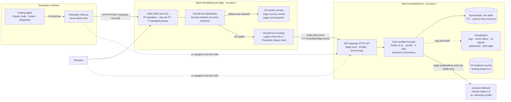

# Threefold architecture

What is deployed, how a tool call and a page request travel through it, where
state lives, and the trade-offs behind each choice, including the ones that
cost something.

How to read the tags. **[PRIMARY, 2026-09-22]** marks a claim checked that day
against a live stack with a read-only request or a `describe`/`get` call, and
the check is named beside it. **[STATE-FILE]** marks a claim taken from
`STATE.md` and not re-measured here. Everything else describes the code on
`main` and names the file it comes from.

---

## 1. Topology



The same picture in words:

```
viewer or hook ──► CloudFront (WAF, security headers)            us-east-1
                     ├─ /, *.html, /app, /assets/* ──► S3 (private, OAC)
                     └─ API paths (20 behaviors) ──► viewer-host function
                                                      + X-Threefold-Edge
                                                          │
                                                          ▼
                   API Gateway HTTP API, stage prod               eu-west-1
                     (throttle 100 rps, burst 200, access logs)
                                                          │
                                                          ▼
                   One Lambda (python3.11, arm64, 256 MB, 15 s,
                     X-Ray active, reserved concurrency 25)
                     ├─► DynamoDB single table (TTL, PITR)
                     ├─► Bedrock Converse, Haiku 4.5 (pages and drafts only)
                     └─► CloudWatch Logs: EMF records, metric filters, alarms
```

What was checked on the live public stacks **[PRIMARY, 2026-09-22]**:

| Piece | Check | Answer |
|---|---|---|
| Edge site | `GET https://d1og72wpk4aqig.cloudfront.net/` | 200 `text/html`, `server: AmazonS3`, `via: ... (CloudFront)` |
| Edge security headers | response headers of that GET | `strict-transport-security: max-age=63072000; includeSubDomains`, `content-security-policy: default-src 'none'; ...`, `x-frame-options: DENY`, `x-content-type-options: nosniff`, `referrer-policy: no-referrer` |
| Edge routes API paths to the function | `GET .../status`, `.../api/overview?days=7`, `.../install.py`, `.../dist/manifest.json`, `.../openapi.json`, `.../prod/status` | all 200, JSON or text from the function |
| Distribution | `aws cloudfront get-distribution` | `Deployed`, 3 origins, 21 cache behaviors, the web ACL attached |
| Web ACL | `aws wafv2 get-web-acl` | rules `AmazonIpReputationList`, `RateLimitPerIp`, `CommonRuleSet`, `KnownBadInputsRuleSet` |
| Edge stack | `aws cloudformation describe-stacks --stack-name threefold-prod-edge --region us-east-1` | `RateLimitPerFiveMinutes=1000`, `PriceClass_100`, `AccessLogs=true` |
| API stage | `aws apigatewayv2 get-stage --api-id raa131f9dj --stage-name prod` | `ThrottlingRateLimit 100`, `ThrottlingBurstLimit 200`, access logs to `/aws/vendedlogs/apigateway/threefold-prod/access` |
| Function | `aws lambda get-function-configuration`, `get-function-concurrency` | `python3.11`, `arm64`, 256 MB, 15 s, tracing `Active`, reserved concurrency 25 |
| Table | `aws dynamodb describe-continuous-backups`, `describe-time-to-live` | point-in-time recovery `ENABLED`, TTL on `ttl` `ENABLED` |
| Alarms | `aws cloudwatch describe-alarms --alarm-name-prefix threefold-prod-` | 10 alarms, all `OK` |
| Dashboard | `aws cloudwatch list-dashboards` | `threefold-prod-operations` |
| API stack parameters | `aws cloudformation describe-stacks --stack-name threefold-prod` | `PublicReads=true`, `DefaultHookStage=observe`, `BedrockModelId=eu.anthropic.claude-haiku-4-5-20251001-v1:0`, `ReservedConcurrency=25`, `MonthlyBudgetUsd=0` |

The API's own URL, `https://raa131f9dj.execute-api.eu-west-1.amazonaws.com/prod/`,
stays public and serves the same pages from the function. It answers without
any of the edge's security headers: a `GET /prod/dashboard.html` returned only
`content-type`, `content-length`, `cache-control: no-cache` and API Gateway's
request id **[PRIMARY, 2026-09-22]**. The bare `/prod` without the trailing
slash is API Gateway's own 404, before the function is reached **[PRIMARY, 2026-09-22]**.

---

## 2. How a request travels

### 2.1 A visitor opens the dashboard

1. `GET https://d1og72wpk4aqig.cloudfront.net/dashboard.html` passes the web ACL
   and matches the distribution's default behavior, so it is read from the
   private bucket through origin access control. `scripts/publish_web.py`
   uploaded that page with `__THREEFOLD_BASE_PATH__` replaced by the empty
   string, because behind the edge the pages and the API share one origin.
2. The page loads `/assets/threefold.js` (bucket, long edge cache, invalidated
   on every publish) and fetches `/api/overview`, `/api/projects` and so on.
   Those paths match API behaviors: caching disabled, every viewer header except
   `Host` forwarded, the viewer-host function run on the viewer request, and the
   origin sends `X-Threefold-Edge` with the edge secret.
3. API Gateway applies the stage throttle and invokes the function, which
   strips the stage, checks the request in `security_middleware.py` and routes it
   in `api_handlers.py` / `app_routes.py`.
4. Charts are inline SVG drawn by `assets/threefold.js`. There is no chart
   library and no build step; Tailwind comes from its CDN at a pinned version,
   which the edge's content security policy names exactly.

### 2.2 A coding agent's tool call

1. The agent is about to run `Write`, `Edit`, `MultiEdit`, `NotebookEdit` or
   `Bash` (Claude Code), `apply_patch`, `Edit`, `Write` or `Bash` (Codex), or
   `write_to_file`, `replace_file_content`, `multi_replace_file_content` or
   `run_command` (Antigravity), and hands the call to `threefold_hook.py` on
   stdin.
2. The hook decides locally what may leave the machine (section 3). A
   credential is refused there and never sent.
3. What remains is one `POST /evaluate-tool-call` to the endpoint the
   repository's `.threefold.json` names. An install made from the edge names the
   edge, because the function writes the viewer's host into `/install.py` when
   the request carries the edge secret (section 7.6).
4. The function runs the gates (section 4.2), applies the project's stage,
   records one ledger row and one rollup increment, and answers.
5. On a refusal the hook prints a deny in the agent's own format, with the
   validated fix's one-line summary appended; on an approval, and in Observe,
   it prints nothing, so the agent's own permission flow runs unchanged.

The hook always sends `explain: false`, so no model is called for its
verdict, refused or not: `bedrock_reviewer.py` returns the deterministic
sentence before any model call for an approval or for a caller that sent
`explain: false`, which `tests/integration/test_bedrock_stays_off_the_enforcement_path.py`
pins.

### 2.3 A page asks for an explanation

The demo page (`index.html`), the connect page and the last step of the
dashboard's `#/try` walkthrough send `explain: true` (the walkthrough's call
imitates a hook, `origin: "hook"`, on a sandbox project, but asks for the
sentence because a visitor reads it). A body that leaves `explain` out is read
as true. When the verdict is a refusal and the caller asked,
`bedrock_client.py` asks Claude Haiku 4.5 through the
`eu.` cross-region inference profile for one sentence, with a 1 s connect and
2.5 s read timeout, at most 200 successful calls per container, and arguments
redacted and cut to about 2 KB before they reach the prompt. The response
names its source in `explanation_source`: `bedrock`, or a deterministic
fallback when the model was not asked or not reached. The verdict itself was
decided before the model was asked and does not change with its answer.

### 2.4 An architect drafts a rule

`POST /rules/draft` (from `rules.html`) sends a sentence and optional example
files. `rule_drafter.py` asks Bedrock for one layering rule, then treats the
answer as untrusted: it is parsed as JSON, checked by the same
`validate_rules` a save uses, set to `observe`, and tried on the examples by the
functions `POST /rules/explain` uses. Nothing is stored. A draft becomes a rule
only through `POST /rules`, which needs the operator on every stack. The route
is capped at 400 answer tokens and one repair (two model calls at most per
draft) and 60 drafting calls per container. When the model cannot be reached
the caller gets no draft rather than a canned one.

---

## 3. The hook on the developer machine

`src/threefold/hooks/threefold_hook.py` is one standard-library file for three
agents, served at `/hooks/threefold_hook.py` and inside
`/dist/threefold-bundle.zip`. The installer puts one shared copy in
`THREEFOLD_HOME/bin/` (`~/.threefold` unless set) and registers it in
`.claude/settings.local.json`, `.codex/hooks.json` and `.agents/hooks.json`.

**Configuration.** Each setting is read from the environment variable, then
`<project root>/.threefold.json`, then `THREEFOLD_HOME/config.json`.
`.threefold.json` holds `project` (an `Acme-*` alias), `endpoint`, `mode`,
optionally `api_key_file` (a path, never the key) and optionally `include`
(globs; a call is sent only when everything it targets falls inside them). A
key is never sent to an endpoint that only a repository's file names, unless
the owner paired that endpoint with the key file in `THREEFOLD_HOME/config.json`.

**Decided on the machine, before any network call.**

- A credential in the call (the same ten shapes the service matches) is
  refused locally, in every mode, and never sent.
- Six kinds of call are held back, neither sent nor recorded by the service:
  `outside-root` (a target outside the project root), `agent-config` (under
  `~/.claude`, `~/.codex` or `~/.gemini`), `data-file` (by extension and by
  directory, `.git` included), `never-send` (a term from the owner's local
  `never_send.txt`), `not-included` (outside the `include` globs) and
  `no-project` (no project configured). `held_back.log` records the time and
  the category only. A call held back is not checked by anything.
- A write made with a file tool (`Write`, `Edit`, a patch, `write_to_file` and
  the like) to the files that decide whether the hooks run
  (`.claude/settings*.json`, `.codex/hooks.json`, `.codex/config.toml`,
  `.agents/hooks.json`, `.threefold.json`, `.git/hooks/`, `.git/config`) is
  refused locally in `enforce` mode, and in `managed` mode only while the stage
  last seen for the project is `enforce`. Otherwise the two differ by where the
  file lives. The agent settings files and `.threefold.json` are sent as their
  path, without their content, and the service records the attempt under
  `PROTECTED_PATH`, as a would-refuse in Observe. `.git/hooks/` and
  `.git/config` sit under `.git`, a data directory, so a file-tool write to
  them is held back as `data-file` (the bullet above): not sent, not recorded,
  and so absent from Observe and the review queue, although it is the write
  that would switch the pre-commit check off. A shell command that writes to
  any of these files is not refused on the machine in any mode: it is sent
  whole, and the service refuses it as `PROTECTED_PATH` where the project
  enforces and records it as a would-refuse where it observes.

**What leaves the machine,** for a call that is sent: the session id, the
project alias, `anonymous` or a 12-hex hash of `THREEFOLD_DEVELOPER` computed
locally, the tool name, the action type and the arguments (for a write, the
text being written), with paths made relative to the project root and a
command's working directory as `cwd`; plus `agent`, `origin: "hook"`,
`explain: false`, `hook_mode`, and `dry_run` when the mode says so.

**Modes.**

| Mode | Sent as | Who decides | Default for |
|---|---|---|---|
| `managed` | a real call | the project's stage on the service: Observe records, Enforce refuses | `connect` |
| `observe` | `dry_run` | nobody refuses: a hard cap on this machine, whatever the stage | the older `--repo` installer form |
| `enforce` | a real call | the project's stage on the service, as in `managed`; on the machine, a file-tool write to the hooks' own files is always refused | the hook alone, with no configuration |

The hook caches the `project_stage` each response names in
`THREEFOLD_HOME/stage/`, which is how `managed` knows the stage without asking.

**When the service cannot answer.** A timeout (4 s by default), a network
failure, a 429 or a 5xx means the call could not be judged: the hook prints
nothing and exits 0, so the agent's own permissions decide.
`THREEFOLD_FAIL_CLOSED=1` refuses such calls instead. Any other 4xx is read as
the service refusing the call, which is why the edge's rate limit answers 429
rather than 403, and why a hook pointed at a path the edge does not route (a
POST that lands on the bucket answers 403) refuses every call. The local checks
above do not depend on the network and still apply.

**At commit.** The installer also adds a pre-commit hook running
`threefold_cli.py check`, which judges the staged content with the same engine
and the rules committed at `HEAD`, offline.

---

## 4. The service: one Lambda function

### 4.1 Layers

The code follows a clean-architecture split, and the domain imports nothing
outside the standard library.

| Layer | Directory | What lives there |
|---|---|---|
| Domain | `src/threefold/domain/` | the session aggregate and tool invocation (`models.py`), the cost breaker and token pricing (`circuit_breaker.py`), the loop detector, the boundary guard and credential scan (`boundary_guard.py`), layering rules, import readers for Python, Java, C# and TypeScript, segment-by-segment path matching, and the shell-write reader (`shell_writes.py`) |
| Application | `src/threefold/application/` | the evaluator and its stages, rule keys, the validated fix proposer, the ledger, rollups, insights and self-correction, projects and readiness, the sandbox, the rule drafter, the Bedrock reviewer and the certificate issuer |
| Infrastructure | `src/threefold/infrastructure/` | the DynamoDB repository, the sign-in store, the Bedrock client, the security middleware and rate limiter, EMF metrics, retries and the idempotency cache |
| Interfaces | `src/threefold/interfaces/`, `src/threefold/web/`, `src/threefold/hooks/`, `src/threefold/tools/` | the Lambda handler and its routes, the local development server, the pages and assets, the hook, the installer and the pre-commit CLI |

### 4.2 The gates, in the order they run

`GovernanceEvaluator._run_gates` in `application/evaluator.py`:

1. **A halted session** refuses every call (`BLOCKED_CIRCUIT_BREAKER`).
2. **The boundary guard** reads the call once: a credential in any argument, at
   any depth (`BLOCKED_SECRET_DETECTED`); then the layering rules in force for
   the calling project, protected paths (`.env`, keys, the hooks' own settings,
   `.git/hooks`, `git commit --no-verify` and the other ways to switch hooks
   off), writes made through the shell whose content cannot be read, and
   destructive commands (`BLOCKED_BOUNDARY_VIOLATION`). A shell command is
   read for the writes it makes (`domain/shell_writes.py`), so a heredoc into a
   domain file is judged like a `Write`.
3. **The loop detector** looks for any repeating cycle of byte-identical call
   signatures, up to period six. A repeated read or poll (`git status`, `ls`,
   `gh run view`, a file read) is noted and never refused. For a hook the
   repeating call is refused and the session is not halted; for the demo's
   `sim-*` and page sessions the session is halted, which is the flagship demo.
4. **The cost breaker** refuses a call whose projected cost exceeds the
   single-call cap, which comes from the policy (`max_single_call_usd`, $1.00 on
   the public stack **[PRIMARY, 2026-09-22]**, `GET /policy/config`), or that would
   take the session past the `budget_usd` the call declares ($10.00 when the
   caller sends none, `application/dtos.py`). Tokens are the caller's own
   declaration, and every call is priced at the default Sonnet-class rate
   because no model id reaches `TokenCostCalculator` **[STATE-FILE]**. A hook
   declares no tokens, so a hook call costs nothing here.

**Stage.** For calls with `origin` `hook` or `ci` that are not dry runs, the
project's configured stage applies (`CONFIG#project#<name>`), or the stack's
`DefaultHookStage` when the project has none (`observe` on the public stack
**[PRIMARY, 2026-09-22]**). Observe evaluates the call as a dry run: recorded,
never refused, never halting. Enforce runs the gates and turns a refusal whose
rule key the project still observes into an observation. Page calls and every
call in a `sim-` session always enforce, whatever their origin, so the demo
behaves the same under any setting (`application/projects.py`, `stage_applies`).
The request's `hook_mode` is recorded on the ledger row and plays no part in
choosing the stage, so a machine in `enforce` mode is refused only where the
project enforces. The last step of the `#/try` walkthrough sends its call in a
`sim-` session, so that refusal does not depend on the promotion before it.

**Rule key.** Every ledger row carries `rule_key`: the id of the layering rule
that decided, or `LOOP`, `PROTECTED_PATH`, `UNREADABLE_WRITE`, `CREDENTIAL`,
`BUDGET`, `HALTED_SESSION`, or `NONE`. Readiness, the review queue and the
charts group by it.

**The fix.** `application/fix_proposer.py` builds a concrete fix for a
refusal (a rewritten file, an adapter and a port, an environment lookup in
place of a literal credential) and runs every proposed write back through the
same gates with the same rules before offering it; `validated` is true only
when all of them passed. No model is involved. The response carries it as
`suggested_fix`, and the hook appends its one-line summary to the deny reason.
Past a size ceiling per kind of fix (1,500 characters for a rewrite) a refusal
goes out without one, so the fix never costs more time than the gate.

### 4.3 What a decision writes

`record_decision` writes one ledger row per decision, credential text
redacted before it is kept, and adds the decision to its day's rollup with
DynamoDB `ADD`. The rollup is best effort: a failed increment never fails a
verdict. Tiles and charts read the rollups, so they stay exact however busy
the ledger is; lists read the ledger. Review labels (`correct`, `false_alarm`)
are stored on the ledger row itself.

`scripts/backfill_rollups.py` adds ledger rows written before rollups existed,
each exactly once: a row is claimed by a conditional update before it is
counted.

### 4.4 Access

`infrastructure/security_middleware.py` decides every request before routing.

- **Reads.** With `PublicReads=true` (the public stack) the data behind the
  pages is readable anonymously; with `false` it needs the operator.
- **Writes that outlive their caller** (the policy, the layering rules, a
  project's stage and reviews) need the operator on every stack. On the public
  stack a project named `Acme-Sandbox-<8 hex>` is writable by anyone, which is
  what `#/try` uses, and `POST /api/sandbox` is open there only.
- **The operator** is a key from `PolicyWriteApiKeys` (`X-API-Key` or
  `Authorization: Bearer`) or a live sign-in session. The public stack is
  deployed with no key, so its policy and rules writes are refused outright and
  sign-in is closed there (`POST /api/auth/links` answered 403 "Sign-In Is
  Closed Here" in `docs/evidence/PROBES_2026-09-22.md`).
- **Sign-in without pasting a key.** `threefold.py open` sends the key from a
  local file in a header to `POST /api/auth/links`, gets a single-use code that
  expires in 120 seconds, and opens `dashboard.html#/signin?code=...`. The page
  exchanges the code for a session token valid for 12 hours. Codes and tokens
  are stored only as SHA-256 hashes; the browser never holds the key.
- **Per-address limit.** A token bucket per client address, 60 requests in a
  burst and 2 a second, kept in each container's memory. Bodies over 1 MB are
  refused.

### 4.5 Files the function serves

The pages and `/app`, `/assets/*` with the base path substituted, the hook at
`/hooks/threefold_hook.py` (and its older names), `/install.py` with the
stack's own address written in, `/dist/threefold-bundle.zip` and
`/dist/manifest.json` (the SHA-256 of every file, of the zip and of
`/install.py` as that host serves it), `/openapi.json` and `/proof.json`. All
are open on every stack, because a hook has to be fetchable before anyone
signs in.

---

## 5. State: one DynamoDB table

`PAY_PER_REQUEST`, partition key `PK` and sort key `SK`, server-side
encryption with the AWS managed key, TTL on the attribute `ttl`, point-in-time
recovery on (both checked live, section 1).

| Item family | `PK` / `SK` | Holds | Expires |
|---|---|---|---|
| Session | `SESSION#<session id>` / `METADATA` | the session aggregate: last 50 calls of history, cumulative cost and tokens, halt state and reason | 30 days |
| Ledger | `DECISION#<YYYY-MM-DD>` / `<timestamp>#<verdict id>` | one row per decision: project, developer hash, agent, origin, tool, target, status, `rule_key`, stage, hook mode, review label | 30 days |
| Rollups | `STATS#<YYYY-MM-DD>` / `<project>` | counters added per decision: calls, approved, refused, observed, per agent, per origin, per rule key | 35 days |
| Shared rules | `CONFIG#rules` / `METADATA` | the layering rules every project without its own set uses | never |
| Project rules | `CONFIG#rules#<project>` / `METADATA` | one project's layering rules | never |
| Project stage | `CONFIG#project#<name>` / `METADATA` | stage, observed rule keys, timestamps, last 20 history entries, sandbox flag | never; a sandbox after 24 hours |
| Project index | `CONFIG#projects` / `<name>` | a copy of every project's configuration, so the list is one Query | as above |
| Policy | `CONFIG#policy` / `METADATA` | the thresholds `/policy/config` returns | never |
| Sign-in | `AUTH#<sha256>` / `CODE` or `SESSION` | a sign-in code or a session, by hash only | 120 s for a code, 12 hours for a session |

Every access is by key, except the sessions listing, which scans for session
metadata, in pages of at least 100 items and at most 50 pages per request.

---

## 6. Operations

- **Logs.** The function's log group keeps 30 days; the API access log keeps 14
  days, because every line holds a client address.
- **Metrics.** The function writes one CloudWatch Embedded Metric Format record
  per evaluated call to `Threefold/Governance` (dimensions `Project` and
  `Environment`). Both stacks write that namespace, so five metric filters read
  the same records from each stack's own log group into `Threefold/<stack name>`:
  `ToolCallsEvaluated`, `VerdictApproved`, `CircuitBreakerTripped`, `LatencyMs`,
  `CurrentSessionCostUSD`.
- **Alarms (10).** Function errors, throttles and p95 duration; API 5xx rate and
  4xx rate; table throttled requests and system errors; calls into halted
  sessions; average evaluation latency; call volume. Each notifies the SNS topic
  `<stack>-alarms` when it fires and when it clears, and treats missing data as
  not breaching. `AlarmEmail` subscribes an address (NoEcho); empty, the alarms
  still show their state in the console.
- **Dashboard.** `<stack>-operations`: the API, the function, the table, the
  governance metrics from this stack's log, and an account-wide Bedrock row.
- **Tracing.** X-Ray is active on the function. The X-Ray SDK is not bundled,
  so a trace shows the invocation and its cold start, not each DynamoDB or
  Bedrock call inside it, and an HTTP API does not start traces itself.
- **Budget.** `MonthlyBudgetUsd` creates an account-wide cost budget on the
  topic; 0, the value on the public stack, creates none.
- **Live probe.** `scripts/probe_live.py` checks a deployed stack against the
  project's claims. The committed run against the public API URL ended
  113 PASS, 0 FAIL, 3 SKIP (`docs/evidence/PROBES_2026-09-22.md`). No probe of
  the edge URL is committed yet.

---

## 7. Two stacks, one template

| | Public demo | Private stack |
|---|---|---|
| Stack | `threefold-prod`, eu-west-1, with `threefold-prod-edge` in us-east-1 in front | a second stack from the same `deploy/template.yml` |
| `PublicReads` | `true` | `false`: the ledger, sessions, rules and policy need the operator |
| Operator key | none, so policy, rules and stage writes are refused and sign-in is closed | set, so the owner signs in with `threefold.py open` |
| Traffic | the demo, the sandbox walkthrough, probes, visitors | the owner's own work at nine locations under `Acme-Proj-*` aliases, all projects in Observe **[STATE-FILE]** |
| In this repository | its URLs, its evidence | its stack name only; its address and key live on the owner's machine and are never committed |

Only aggregate numbers from the private stack may ever reach a public page,
through `scripts/build_proof.py`, which refuses to write if any string in its
output matches a project name, the key or an absolute path. The committed
`proof.json` has no private section yet.

---

## 8. Trade-offs, stated honestly

### 8.1 Why one Lambda

Every route needs the same evaluator, the same rules cache and the same session
store, and a hook's verdict, a page's chart and a sign-in all read the same
table. One function means one deployment unit, one set of warm containers and
one place where the gates' code lives, so the page's "try it" and the hook's
verdict cannot drift apart.

What it costs. Page reads and hook verdicts share one reserved concurrency of
25, so a flood of dashboard loads competes with governed tool calls; the API
throttle (100 requests a second, burst 200) and the edge's per-address limit are
what keep that flood out. One role carries the union of what every route needs:
Bedrock, the table (including `Scan` and `DeleteItem`) and the unused evidence
bucket. And every in-memory limit (the per-address bucket, the Bedrock call
caps) is per container, not per account: N busy containers allow N times the cap.

### 8.2 Why a single table

Every access pattern is by key: a session by id, a day of the ledger by
partition, a day's rollups by partition, a project's configuration by name, a
sign-in by hash. One table gives one TTL attribute, one point-in-time recovery
setting, one IAM grant and one set of throttling alarms.

What it costs. All of one day's decisions share one partition key, so the
ledger's write rate for a single day is bounded by what one partition accepts;
no load test has been run, so no ceiling is claimed. The sessions listing is a
scan, bounded in pages rather than avoided. A restore from point-in-time
recovery creates a new table, and the stack has no switch to point the function
at it; no script for that exists.

### 8.3 Why the hook fails open by default

The hook sits in front of every write an agent makes. If a governance outage
stopped every developer's work, the first outage would end the rollout. So
when the service cannot answer, the hook prints nothing and the agent's own
permission flow decides.

What it costs. While the service is unreachable, nothing is judged by the
service: no layering rule, no loop detection, no ledger row. What still holds
is decided on the machine: a credential is refused, and in enforce (or managed
at an enforcing stage) a file-tool write to the hooks' own files is refused. A team that
prefers the other failure sets `THREEFOLD_FAIL_CLOSED=1`. The pre-commit check
runs offline and catches what reached a commit.

### 8.4 Why Bedrock is off the enforcement path

A verdict has to be the same for the same call, fast enough to sit in front of
every edit, free to repeat, and immune to what the call itself says. A model
is none of those: it is non-deterministic, it adds a network round trip and a
bill per call, and it would be reading text an agent wrote, which is where a
prompt injection would live. So the gates are standard-library Python and the
model is asked only after a refusal, only when the caller asked for a sentence
a person will read (the pages do; the hook always sends `explain: false`), and
only to phrase what was already decided. Approvals never call it, a real
hook's verdict never waits on it, and review labels and promotions never
involve it. Rule drafting uses it as a proposer whose output is
validated, set to observe and never saved without the operator.

What it costs. A hook's refusal carries the deterministic reason and the fix's
summary, not a model's sentence.

### 8.5 Why pages are served both by S3 behind the edge and by the function

The API URL was the project's first public address. It is in the evidence
files, it is the hook's built-in default endpoint, and installs made before the
edge point at it, so it keeps working exactly as before, pages included. The
edge adds what the function cannot give on its own: a web ACL, security headers
on every response, caching, and pages that are not an invocation each.

What it costs. There are two copies of every page. The function serves the
copy deployed with its code; the edge serves whatever `publish_web.py` last
uploaded, so a deploy that changes a page is not visible at the edge until the
pages are published again. On 2026-09-22 the two `dashboard.html` copies were
the same size, 159,267 bytes **[PRIMARY, 2026-09-22]**. The API URL has no web
ACL and none of the edge's headers (section 1), and anyone can reach every
route there, past the edge.

### 8.6 What the edge secret protects, and what it does not

Behind CloudFront the function would see an edge server as the caller and the
API's own name as the host. Two things broke without a fix: the per-address
limit put every viewer of one edge server in one bucket, and `/install.py`,
the manifest and sign-in links named the API URL, so a hook installed from the
edge talked to the API directly, past the web ACL.

Both API origins therefore send `X-Threefold-Edge` with a secret equal to the
API stack's `EdgeOriginSecret`, and CloudFront overwrites a viewer's own header
of that name. Only on a request carrying it does the function believe
`CloudFront-Viewer-Address` and the `X-Threefold-Viewer-Host` the viewer-host
function sets. Checked live **[PRIMARY, 2026-09-22]**: `/install.py` fetched
from the edge carries `BAKED_ENDPOINT = "https://d1og72wpk4aqig.cloudfront.net/"`;
fetched from the API URL it carries the API URL; and fetched from the API URL
with a forged `X-Threefold-Viewer-Host`, with and without a wrong
`X-Threefold-Edge`, it still carries the API URL.

What it does not do:

- It is not authentication. The API URL stays public, every route answers
  there, and a caller who uses it skips the web ACL and the edge's headers.
- It does not keep reads private. That is `PublicReads`.
- It is readable inside the account: the distribution's configuration holds it
  (anyone allowed `cloudfront:GetDistributionConfig`) and so does the
  function's environment (`lambda:GetFunctionConfiguration`, which the CI
  deploy role has). `NoEcho` keeps it out of `describe-stacks` only.
- It does not rotate itself. Changing it means deploying both stacks with the
  new value; until both agree, the function treats edge requests as untrusted.

---

## 9. The certificate, and what it is not

`POST /issue-certificate` returns a record over a session's verdicts with an
unkeyed SHA-256 fingerprint. It detects accidental corruption and casual edits.
It is not tamper evidence: anyone who changes the payload can recompute the
hash. It is returned in the response and not archived; the S3 bucket the stack
provisions stays empty. An empty evaluation list, or a session this service has
no record of, is refused with 400, but the evaluations themselves are the
caller's word, and nothing in CI verifies a certificate before a merge
**[STATE-FILE]**. Signing with KMS and issuing from the session's stored history
would make it load-bearing; neither is done.
